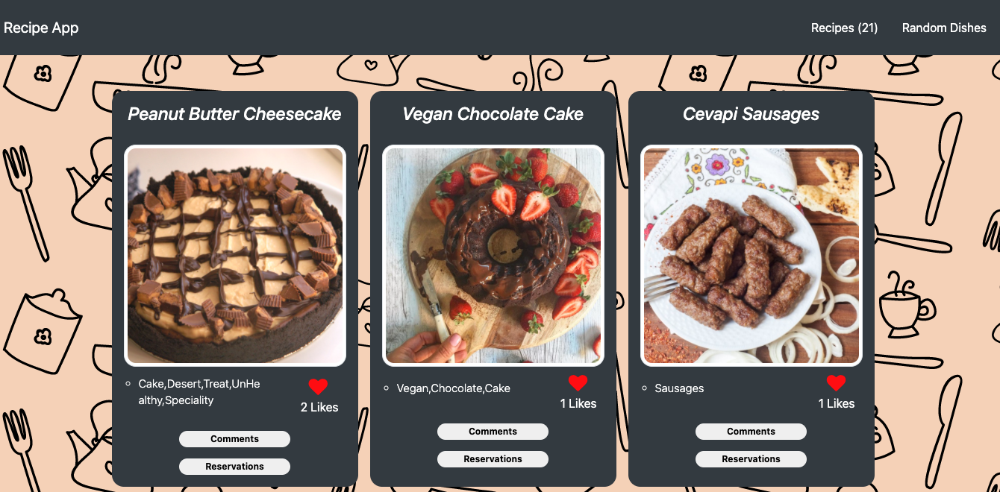

# Recipe book

> A JavaScript application that uses a food API for showing and sharing recipes

Save your favorite food recipes, comment them and give them a like

## Built With

- HTML
- CSS
- JavaScript

## Getting Started

To get a local copy up and running follow these simple example steps.

### Prerequisites
 A modern web browser (Chrome, Firefox, Safari, Microsoft Edge)

### Usage
 Clone the project by typing in your terminal `git clone https://github.com/SunnySparks/Recipes-book.git`.

 Change directory `cd` into the just created from the project.

 Run `npm install`.
 
 Run `npm start`.

 Your computer will open the main page where you can add your name and score
 
## Run tests
 Clone the project using `git clone https://github.com/SunnySparks/Recipes-book.git`.

 Run `npx eslint .` for javascript linters.

 Run `npx stylelint "**/*.{css,scss}"` for style linters.

<!-- ### Live Demo Server -->

## Author

👤 **Sunny Díaz**

- GitHub: [@SunnySparks](https://github.com/SunnySparks)
- Twitter: [@JosfranT6](https://twitter.com/JosFranT6)
- Instagram: [@webdev.sunnydiaz](https://www.instagram.com/webdev.sunnydiaz/)
- Portfolio: [sunnydiaz.com](https://sunnydiaz.com/)
- LinkedIn: [LinkedIn](https://www.linkedin.com/in/jose-f-silva/)

👤 **Ramiro Aquistapace**

- GitHub: [@ramiaquista](https://github.com/ramiaquista)
- Twitter: [@ramiaq1](https://twitter.com/ramiaq1)
- LinkedIn: [RamiroAquistapace](https://www.linkedin.com/in/ramiro-aquistapace-32b61b204/)
## 🤝 Contributing

Contributions, issues, and feature requests are welcome!

Feel free to check the [issues page](https://github.com/SunnySparks/Recipes-book/issues).

## Show your support

Give a ⭐️ if you like this project!

## Acknowledgments

- Creating and accessing to HTML elements via DOM
- JavaScript best practices

## 📝 License

This project is [MIT](./MIT.md) licensed.
